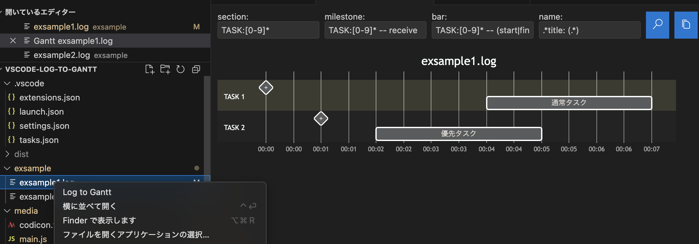

# vscode-log-to-gantt README

ログから実行時間を抽出して、`Mermaid`のガントチャートチャートを生成します。  

- CATION: 24分以上のガントチャートはエラーになります。
  - `Mermaid`のガントチャートでは、時分しか扱えません。
    - `Log to Gantt`では、ログの分秒を時分に変換するため、`23:59`より大きな時刻を扱えません。

## Features



- a) ログファイルを右クリックし、メニューの'Log to Gantt'を選択する。
- b) 検索条件を入力して、検索ボタンを押す。
  - section: セクション名を検索する正規表現を入力 例) 'TASK:[0-9]* '
  - milestone: マイルストーンの行を検索する正規表現を入力 例) 'TASK:[0-9]* -- receive'
  - bar: バーの処理行を検索する正規表現を入力 例) 'TASK:[0-9]* -- (start|finish)'
  - name: バーの名前を検索する正規表現を入力(表示する場所を括弧で囲う) 例) '.*title: (.*)'
- c) 神作ボタンを押すと、ガントチャートチャートをレンダリングして表示する。
- d) コピーボタンを押すと、ガントチャートチャートをテキストで、クリップボードにコピーする。

``` log
Jul 2 23:59:00 TASK:1 -- receive title: 通常タスク
Jul 2 23:59:01 TASK:2 -- receive title: 優先タスク
Jul 2 23:59:02 TASK:2 -- start
Jul 2 23:59:03 TASK:2 info: information message.
Jul 2 23:59:04 TASK:1 -- start
Jul 2 23:59:05 TASK:2 -- finish
Jul 2 23:59:06 TASK:1 debug: debug message.
Jul 2 23:59:07 TASK:1 -- finish
```



``` mermaid
gantt
  title exsample1.log
  dateFormat HH:mm
  axisFormat %H:%M
  todayMarker off

  section TASK 1
    +: milestone, 00:00, 0m
    通常タスク: 00:04, 00:07
  section TASK 2
    +: milestone, 00:01, 0m
    優先タスク: 00:02, 00:05
```

## Requirements

`Visual Studio Code`拡張機能をインストールして下さい。

- [Markdown Preview Mermaid Support / Matt Bierner](https://marketplace.visualstudio.com/items?itemName=bierner.markdown-mermaid)

## Change Log

Check [Keep a Changelog](http://keepachangelog.com/) for recommendations on how to structure this file.

### [Unreleased]

### 1.1.1 - 2025-07-16

- Fixed - 設定ファイルや親ディレクトリ無い場合に対応 #2

### 1.1.0 - 2025-07-15

- Fixed - 検索条件を設定ファイルに保存する #1

### 1.0.0 - 2025-07-05 Official release

- Added - ログファイルを切り替える度に、Ganttパネルの内容を更新する。
- Added - 検索条件の精査
  - バーの開始と終了を１つにまとめる。
  - タイトルの条件を追加する。

### 0.0.4 - 2025-07-03

- Added - ログファイルの選択を別のファイルに変更した場合、同じ'vscode.WebviewPanel'で、検索対象とタイトル表示のみ変更する。
- Fixed - 時間軸は分秒を時分として表示しているため、`00:23:59`を超えると不正な時刻になる。
  - このため、時間軸を開始時刻からの経過時刻にした。
- Fixed - `Marmaid`レンダリングできる様にした。

### 0.0.3 - 2025-07-02

- alpha release

### First build

最初の仕様で、`ChatGPT(GPT‑4o)`にベースを作っていただきました。  
その後、`GitHub Copilot`に訊きながら仕上げました。  

#### 最初の仕様

ログファイルから正規表現で指定した行の時間を使って、mermaidのganttを表示するソフトを作って下さい。

- 動作環境: VSCode 拡張機能
- 開発言語: Typescript
- 画面表示
  - 検索条件を画面上部に表示する。
  - その下に、mermaidのganttのプレビューを表示する。
  - 画面はVSCodeのテーマの配色を適用する事。
  - ボタンには、VSCodeのアイコンを表示する事。
- 操作方法
  - a) VSCodeでMarkdownのプレビューと同じで、ログファイルを右クリックしたメニューの'Log to Gantt'を選択する
  - b) タイトル'Gantt ログファイル名'の'vscode.WebviewPanel'を表示する。
  - c) 検索条件を入力して、表示ボタンを押す。
  - d) mermaidのganttをレンダリングして表示する。
  - e) mermaidのエラーは文字列で表示する。
  - f) コピーボタンを押すと、mermaidのganttをテキストで、クリップボードにコピーする。
- ログファイル
  - 日時は行の最初にあり、様々な形式に対応する事。

  ``` log
  Jul 2 10:00:00 TASK:1 -- receive
  Jul 2 10:00:01 TASK:2 -- receive
  Jul 2 10:00:10 TASK:2 -- start
  Jul 2 10:00:20 TASK:1 -- start
  Jul 2 10:00:25 TASK:1 -- finish
  Jul 2 10:00:30 TASK:2 -- finish
  ```

- 検索条件
  - セクション検索: 'TASK:[0-9]* '
  - マイルストーン表示: 'Receive'
  - マイルストーン検索: 'TASK:[0-9]* -- receive'
  - タスク開始検索: 'TASK:[0-9]* -- start'
  - タスク終了検索: 'TASK:[0-9]* -- finish'

- ガントチャート
  - ログファイルを検索条件で検索した結果、以下のガントチャートを出力する
  - 時分秒を日時分に変換する事。

  ``` mermaid
  gantt
      title Gantt Chart
      dateFormat  HH:mm
      axisFormat %H:%M

      section TASK:1
        Receive :milestone, stone, 00:00, 0m
        TASK1: bar, 00:20, 00:25
      section TASK:2
        Receive :milestone, stone, 00:01, 0m
        TASK2: bar, 00:10, 00:30
  ```
